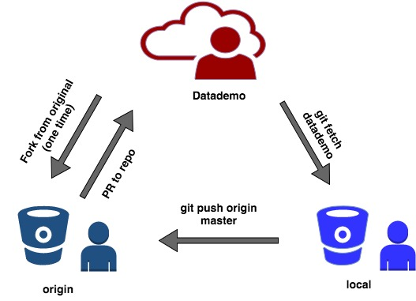
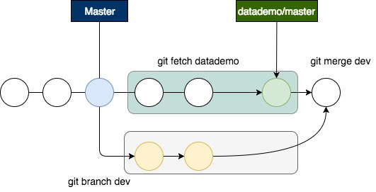

## Git Steps

### Overview

<p align="center">
  
</p>

### First time only

1. In GitHub, fork the repository, https://github.com/datafordemocracy/publicpresidency, to your own github account and go to the forked repository; click on "Clone or Download" and copy the repository URL to the clipboard.

2. In the terminal, navigate to your local directory (where you want the repository to live)

```sh
$ cd "box sync/mpc/datafordemocracy/" # this will be different for you
```

3. Clone the repository locally

```sh
$ git clone https://github.com/mclaibourn/publicpresidency.git # use your GitHub name/url
```

4. Navigate to the new repository

```sh
$ cd publicpresidency
```

5. Tell git about the source repository [(more here)](https://help.github.com/articles/configuring-a-remote-for-a-fork/)

```sh
$ git remote -v # initially only your forked repository should be listed
$ git remote add datademo https://github.com/datafordemocracy/publicpresidency.git # datademo is a name we provided to reference the source repository
$ git remote -v # verify
```

### Syncing local files with source repository

Before adding changes from the repository on your local machine to the forked repository on GitHub (the one in your account,
[see more here](https://help.github.com/articles/syncing-a-fork/), make sure you're working with the most recent files.

1. In the terminal, navigate to your local directory

2. Fetch the contents of the source repository, datademo. so you're starting with the most recent version

```sh
$ git fetch datademo
```

3. Merge the changes from datademo/master into your local master branch

```sh
$ git merge datademo/master # this brings your fork's master branch (working directory) in sync with the source repository's master branch)
```

4. Your local copy of the repository is updated; now update your fork on GitHub

```sh
$ git push origin master # pushes the name on your local machine (origin) to a branch on your GitHub page (master)
```

### Working with local files

Make changes to the forked repository on your local machine; when you're ready, commit those changes to your local repository and push these to your forked repository on GitHub.

1. In the terminal, navigate to your local directory

2. List new or modified files available to be committed

```sh
$ git status
$ git diff # show file differences; use q to exit results
```

3. Stage files for commit, then commit

```sh
$ git add [file]
$ git commit -m "[add commit message]"
```

4. Sync your local files with the source repository (again) and push these to your forked repository on GitHub.

### Syncing local files with source repository (alternative method)

In this method, we'll be using ```git pull``` to sync changes with the remote repository and make use of branch to avoid
merge conflicts.

Before adding changes from the repository on your local machine to the forked repository on GitHub (the one in your account, [see more here](https://help.github.com/articles/syncing-a-fork/), make sure you're working with the most recent files.

1. Have a branch for development
```sh
$ git branch dev  # This will create a branch called dev
$ git checkout dev # This will switch to the branch called dev instead of master

```
2. Now that you have a branch, edit your files in your branch ( whatever code changes you want to make ) and stage it

```sh
$ git add 'files you edited and you want to include'
$ git commit -m <insert commit message>
```

3. Working with pull

Now you have your changes in the local branch called dev. You need to find a way to sync our local repository to
datademo. Inorder to do this and avoid merge conflicts, you need sync your local master with remote ( datademo )  and merge your changes ( on branch dev )
on top of it

```sh
$ git checkout master # switch to branch master
$ git pull datademo master # Pull all changes to branch master
```
At this point, your repository looks something like this:

<p align="center">
  
</p>

You need to merge your changes with the local master and push it to the forked repo. In order to do that, use the
following code

```sh
$ git merge dev    # git will prompt you with a commit file, this is fine. Save it.
$ git add <Files you need to push>
$ git commit -m "Your new commit name"
$ git push origin master  # This will push changes to the forked repository
```

### Make a pull request
When you want to add the changes from your forked repository on GitHub to the source repository

1. Go to source repository on GitHub and click "New pull request"

2. On the compare page, click "compare across forks"; the base fork is the original source repository, the head fork is your fork

3. Give your request a title and description and "Create pull request"

## Some useful links

* [syncing your local to remote](https://www.atlassian.com/git/tutorials/syncing)
* [cheatsheet for Git](http://supercollider.github.io/development/git-cheat-sheet)
* [Git interactive tutorials](https://try.github.io/levels/1/challenges/1)
* [Learn git branching](http://learngitbranching.js.org/)

